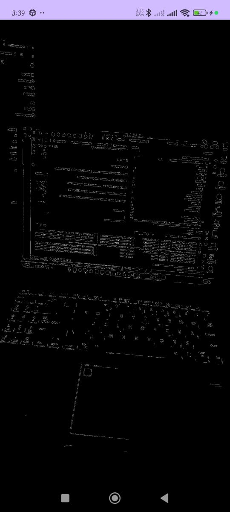
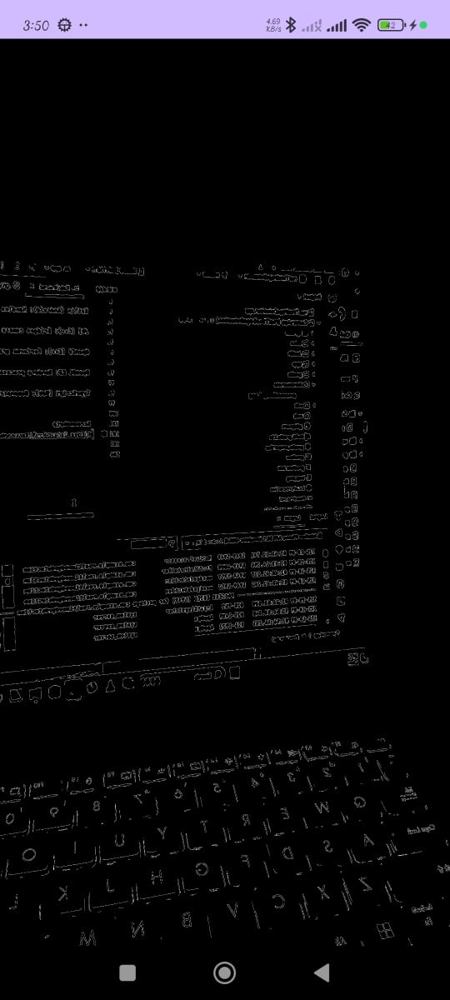

# RealTime Edge Detection (Android + OpenCV-C++ + OpenGL)

## 📌 Overview
This project was developed as part of a **time-bound technical assessment** to demonstrate integration of:
- **Android SDK (Java/Kotlin)**
- **NDK (C++ / JNI)**
- **OpenCV (C++ image processing)**
- **OpenGL ES 2.0 (real-time rendering)**
- **TypeScript (web-based viewer)**

The app captures camera frames on Android, processes them in **native C++ using OpenCV** (Canny edge detection), and renders the output via **OpenGL ES** in real time. A minimal web page is also included to show how processed frames could be exported and displayed in a browser.

---

## 🧩 Features

### ✅ Android App
- **Camera Feed Integration**: Uses `Camera2` API with `TextureView` and `ImageReader` to capture frames.
- **Native Processing (JNI + OpenCV)**:
    - Frames are passed to C++ via JNI.
    - Converted from YUV → BGR → Grayscale.
    - Processed with **Canny edge detection**.
- **OpenGL Rendering**:
    - Processed frames rendered in real time using `GLSurfaceView`.
    - Transparent overlay so camera preview + processed edges can be combined.
    - FPS counter overlay included.
- **Orientation Handling**:
    - Corrects texture rotation and flipping (depending on device sensor).

### 🌐 Web Viewer (TypeScript)
- Minimal **TypeScript + HTML page**.
- Displays a sample processed frame (static Base64 image).
- Shows frame resolution and FPS placeholder.
- Demonstrates ability to bridge native results to a simple web frontend.

---

## ⚙️ Project Structure
project-root/
├── app/ # Android application
│ ├── src/main/java/ # Kotlin sources
│ │ └── com/example/realtimeedgedetection/
│ │ ├── MainActivity.kt
│ │ └── gl/NativeGLRenderer.kt
│ ├── src/main/jni/ # Native C++ sources
│ │ ├── CMakeLists.txt
│ │ ├── NativeProcessor.cpp # JNI + OpenCV edge detection
│ │ └── NativeGLRenderer.cpp # OpenGL renderer
│ └── src/main/res/layout/activity_main.xml
│
├── sdk/ # OpenCV Android SDK
│ └── native/
│ ├── jni/include/ # OpenCV headers
│ └── libs/ # Prebuilt OpenCV .so libraries
│
└── web/ # Web viewer (TypeScript)
├── index.html
├── main.ts
└── tsconfig.json

---

##  Setup Instructions

###  Prerequisites
- Android Studio (with NDK + CMake installed).
- OpenCV Android SDK (copy `sdk/` folder into project root).
- Node.js (for web viewer).

###  Android App
1. Open project in Android Studio.
2. Ensure NDK + CMake are installed:
    - `File > Settings > SDK Tools > NDK (Side by side), CMake`.
3. Build & Run on a real device.
    - Accept camera permission at runtime.
4. You should see:
    - Camera preview.
    - Real-time edge-detected overlay rendered via OpenGL.
    - FPS counter in debug overlay.

// web app 

🧠 Architecture

Kotlin (Android): Handles camera (Camera2), UI setup, GLSurfaceView.

JNI (C++): Bridges camera byte arrays → OpenCV.

OpenCV (C++): Performs grayscale + Canny edge detection.

OpenGL ES: Renders processed frames efficiently on GPU.

TypeScript (Web): Demonstrates exporting native results to web.

Screenshots

