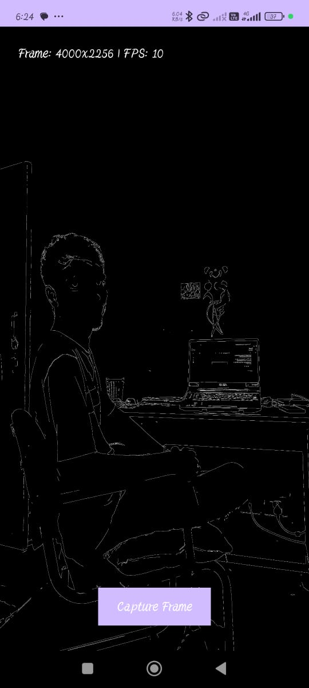
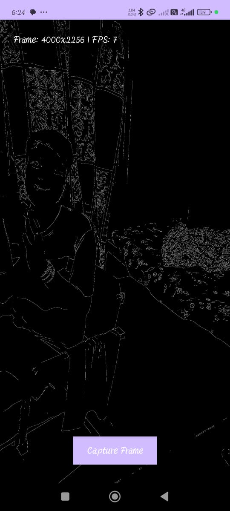
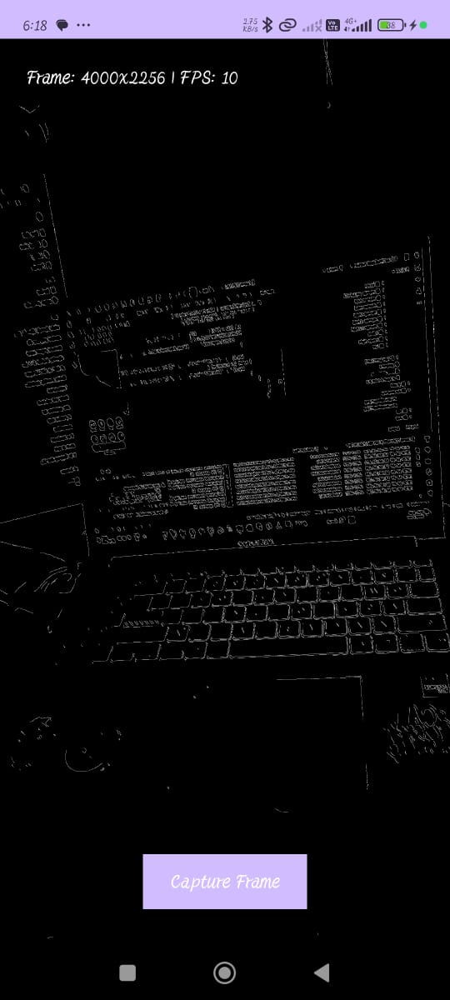

# RealTime Edge Detection (Android + OpenCV-C++ + OpenGL)

## Overview

A small RnD project built to demonstrate a camera → native pipeline:

- Android app (Kotlin) captures camera frames.
- Frames are passed to native C++ (JNI) and processed with OpenCV (Canny edges).
- Processed frames are rendered with OpenGL ES in real time.
- A minimal TypeScript web viewer can display a captured frame (or fetch the latest frame from the device).

This was implemented as a focused integration exercise — emphasis is on JNI/OpenCV/OpenGL interaction and a simple web bridge.

---

## Features

### Android

- Camera2 API capture with `TextureView` + `ImageReader`.
- Native processing in C++ via JNI:
  - YUV → BGR → Grayscale → Canny edge detection.
- OpenGL ES 2.0 renderer (`GLSurfaceView`) to display processed frames.
- FPS / resolution debug overlay.
- Capture button: save the current processed frame to `.../files/Pictures/EdgeDetection/processed.png`.
- Tiny HTTP server (NanoHTTPD) that serves the latest saved frame at `http://<phone-ip>:8080/frame` (optional; enabled in the app).

### Web

- Small TypeScript + HTML viewer that:
  - Fetches the latest frame from the phone server (automatic flow).
- Shows resolution / FPS placeholder.
- Responsive layout (desktop + mobile).

---

## Project layout

project-root/
├── app/ # Android app (Kotlin + JNI + C++)
│ ├── src/main/java/ # Kotlin sources (MainActivity, renderer, server)
│ ├── src/main/jni/ # C++ sources (NativeProcessor.cpp, NativeGLRenderer.cpp)
│ └── src/main/res/layout/ # activity_main.xml
├── sdk/ # (place OpenCV Android SDK here)
│ └── native/
│ ├── jni/include/
│ └── libs/<abi>/libopencv_java4.so
├── web/ # TypeScript web viewer
│ ├── index.html
│ ├── main.ts
│ └── tsconfig.json
└── screenshots/ # Put screenshots / GIFs here

---

## Setup & build

### Prerequisites

- Android Studio (recommended)
- Android SDK with **NDK** and **CMake**
- OpenCV Android SDK (download from OpenCV site)
- Node.js (for the web viewer)

### Prepare OpenCV

- Download the **OpenCV Android SDK**.
- Copy the `sdk/native` folder into the project root as `sdk/` so the path becomes:
  a.project-root/sdk/native/jni/include
  b.project-root/sdk/native/libs/<abi>/libopencv_java4.so
- Confirm `CMakeLists.txt` references those paths (the project includes an example CMake that imports `libopencv_java4.so`).

### Android: build & run

- Open the project in Android Studio.
- Make sure NDK and CMake are installed: `File > Settings > SDK Tools`.
- Add Internet permission (if you use the HTTP server):

```xml
<uses-permission android:name="android.permission.INTERNET" />
```

- Run on a real device (minSdk 24). Grant camera permission at runtime.

## Working

- The app opens the camera and renders processed edges on top of the live preview.

- The FPS / resolution overlay updates every second.

- Press Capture Frame to save the current processed image at:
  "/storage/emulated/0/Android/data/com.example.realtimeedgedetection/files/Pictures/EdgeDetection/processed.png"
  then

### Automatic Web Viewer

If the NanoHTTPD server is enabled in the app, the latest frame can be viewed directly in your browser.

Steps:

    1. Ensure your phone and PC are connected to the same Wi-Fi (or hotspot).

    2. Find your phone’s IP address:

        . On PC → run ipconfig (Default Gateway when connected to phone hotspot), OR

        . On phone → check Wi-Fi → Advanced → IP address.

    3. In web/main.ts, set your phone IP:

        "const phoneIp = "192.168.xxx.xxx"; // replace with your phone IP
            img.src = `http://${phoneIp}:8080/frame?${Date.now()}`;"


    4. Compile the TypeScript: npx tsc


    5. Open index.html in your browser.
        The page will poll the phone every few seconds and display  the latest captured frame automatically.

## Architecture Overview

- Android (Kotlin)
  Handles camera setup, permissions, UI, and forwarding frames to native code.

- JNI (Native bridge)
  Connects Kotlin ↔ C++ for frame transfer.

- C++ (OpenCV)
  Performs image processing (Canny edge detection, grayscale conversion).

- OpenGL ES
  Renders the processed frame efficiently as a texture at ~15 FPS.

- FrameServer (NanoHTTPD)
  A lightweight HTTP server running on the device, serving the latest processed frame to the web client.

- Web (TypeScript)
  Simple HTML + TS page that fetches the latest frame from the device and shows resolution/FPS.

## Quick troubleshooting

- Black/green screen / artifacts: check camera YUV extraction and texture upload alignment (row stride / pixel stride / UNPACK_ALIGNMENT). We handle tight-copy of the Y plane and set glPixelStorei(GL_UNPACK_ALIGNMENT, 1) in the renderer.

- No UI overlay visible: GLSurfaceView z-order can hide views. Use glSurfaceView.setZOrderMediaOverlay(true) and give debug views elevation.

- Saved image is 0 bytes: make sure lastFrame was stored before saving; save into an ARGB_8888 bitmap by mapping grayscale values to RGB.

- HTTP server not reachable:

  ```xml
  <uses-permission android:name="android.permission.INTERNET" />
  ```

  is in AndroidManifest.xml and phone/PC are on the same network. Check Logcat for server start and serve logs.

## Screenshots / GIFs

### Android Apk





### gif


### Web Page


